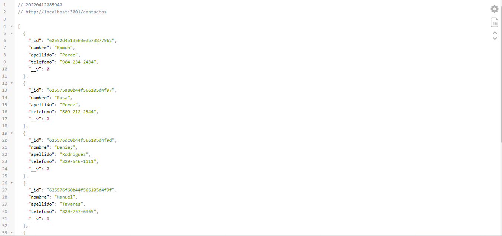

# Project Title

A nice project with a nice description

---
## Requirements

For development, you will need Node.js,node global package and mongodb

## Install

    $ npm install
    $ npm install express mongoose

## Info app

the endpoint is `http://localhost:3001`

* `http://localhost:3001/contactos` 
you can get contacts and send a new contact

## Preview

## Running the project

    $ npm run start
